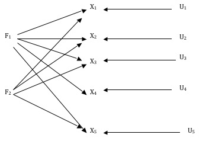

#Introducción
Supongamos que una muestra de consumidores ha valorado su percepción acerca de p atributos o características de un conjunto de *n* marcas. Cuando el número de atributos o características es elevado, es difícil hacerse una idea de cuán parecidas o diferentes son las marcas según la percepción que de ellas tienen los consumidores. Por ello nos preguntamos, ¿es posible representar visualmente *n* marcas en un espacio de reducidas dimensiones, por ejemplo, *k* dimensiones, siendo $k<p$ ? ¿Y, además, que las marcas similares (según la percepción de los consumidores) se sitúen cerca unas de otras? Para ello disponemos de una familia de modelos conocida con el nombre de análisis o escalado multidimensional (MDS, muldimensional scaling). Esta familia de modelos, también, nos proporciona una medida de la discrepancia entre las percepciones observadas y las estimadas por el modelo, un índice de la medida en la que distancias observadas difieren de las estimadas. 

Cuando las medidas acerca de las percepciones se han recogido en una escala métrica o intervalo el análisis multidimensional utiliza el análisis de los componentes principales para su representación visual (Gower y Hand, 1996). En general buscaremos una representación bidimensional, o tridimensional si la primera no reproduce las percepciones de una manera aceptable. Para ello partiremos de una matriz de percepciones, **X**, que contendrá tantas filas, *n*, como marcas y tntas columnas, *p*, como atributos o características describan a los productos. El subespacio de *k* dimensiones proporcionado por los componentes principales pasa por el centro de los datos, por esa razón tenemos que transformar la matriz de datos original, **X**,  sustrayéndole la media de cada una de las medidas. Es habitual, asimismo, dividir las observaciones por su desviación típica, resultando una matriz de datos estandarizados.

La descomposición de la matriz de covarianzas, o correlaciones en la mayoría de los casos, *X’X*, nos proporciona los vectores y valores propios necesarios para construir e interpretar el espacio reducido, $X’X=A \Lambda A’$,  donde *A* es una matriz ortogonal que proporciona los vectores propios, $A’A=I$. Además, los valores de la diagonal de la matriz $\Lambda$ nos proporcionan la varianza explicada por cada uno de los componentes principales (Gower y Hand, 1996). Los vectores propios nos proporcionan un espacio de *k<p* dimensiones alternativo al espacio de las características o atributos en los que se midieron las marcas que estamos analizando. Pero, también, podemos describir el significado de los nuevos componentes  o beneficios que estructuran el mercado  (o, alternativamente, de los vectores propios) analizando la correlación de los atributos con los componentes o factores del nuevo espacio.

El mejor espacio reducido para representar al conjunto de marcas viene dado por los ejes formados por los *k* primeros componentes principales estimados. 
Buscamos una combinación lineal de las variables originales como la siguiente:

$$ C_{1} = a_{11}x{1} + ... +a_{1p}x{p} $$ 
$$ C_{2} = a_{21}x{2} + ... +a_{2p}x{p} $$ 
.
.
.
$$ C_{k} = a_{k1}x{k} + ... +a_{kp}x{p} $$ 

Con ciertas propiedades: 

1.  Que la varianza de $C_{i}$ sea tan grande como sea posible
2.	Que los valores de $C_{1}, ..., C_{p}$ para todos los individuos de la muestra sean independientes, $S_{ij}=0$, para todos y cada uno de los componentes
3.	Para cada componente la suma del cuadrado de los coeficientes de su combinación lineal sea igual a la unidad, $a_{11}^2 + a_{12}^2 + ... + a_{1p}^2 = 1$.

De hecho la proyección de las marcas en el espacio reducido a *k* ejes principales, vendrá dada por predicción del conjunto inicial de medidas en el nuevo subespacio definido por los *k<p* primeros componentes principales $C=XA_{k}$, por ejemplo *k=2*.
$$
\begin{pmatrix}
c_{11} & c_{12} \\
c_{21} & c_{22}  \\
\vdots & \vdots \\
c_{n1} & c_{n2} \\
\end{pmatrix}
=
\begin{pmatrix}
x_{11} & x_{12} & \cdots & x_{1p} \\
x_{21} & x_{22} & \cdots & x_{2p} \\
\vdots & \vdots & \ddots \vdots & \\
x_{n1} & x_{n2} & \cdots & x_{np} \\
\end{pmatrix} 
\begin{pmatrix}
a_{11} & a_{12} \\
a_{21} & a_{22} \\
\vdots & \vdots \\
a_{n1} & a_{n2} \\
\end{pmatrix}
$$
Así la predicción para la primera marca en el primer componente principal (primer elemento de la primera columna de la matriz *C*) vendrá dada por $$ C_{11} = a_{11}x{11} + a_{21}x{21} + ... +a_{p1}x{p1} $$  y así sucesivamente con el resto de los factores o beneficios que estructuran el mercado. 

¿Cuál es la calidad de la representación visual? Nuestro propósito es encontrar un subespacio *k* que minimice la diferencia entre las percepciones medidas y las que visualizamos en el mapa de percepciones. Para conocer la calidad de la representación visual tendremos, primero, que estimar las percepciones que se derivan del modelo visual,  $\hat{X}=C_{k=2}A_{k=2}'$ , 

$$
\begin{pmatrix}
\hat{x_{11}} & \hat{x_{12}} & \cdots & \hat{x_{1p}} \\
\hat{x_{21}} & \hat{x_{22}} & \cdots & \hat{x_{2p}} \\
\vdots & \vdots & \ddots \vdots & \\
\hat{x_{n1}} & \hat{x_{n2}} & \cdots & \hat{x_{np}} \\
\end{pmatrix} 
=
\begin{pmatrix}
c_{11} & c_{12} \\
c_{21} & c_{22}  \\
\vdots & \vdots \\
c_{n1} & c_{n2} \\
\end{pmatrix}
=
\begin{pmatrix}
a_{11} & a_{21} & \cdots & a_{p1} \\
a_{12} & a_{22} & \cdots & a_{p2}\\
\end{pmatrix}
$$

y, después, verificar la diferencia con los datos originales, $X-\hat{X}$ . La suma cuadrado de las diferencias entre lo observado y lo predicho por el modelo, $traza(X-\hat{X})'(X-\hat{X})$  resulta que es idéntica a la varianza no explicada por los componentes principales utilizados para formar el mapa de percepciones, $traza(\Lambda - \Lambda_{k})$. Por ello, cuanto menor sea esa diferencia, mejor será la representación visual de las marcas en el espacio reducido mostrado en el mapa de percepciones. Si lo expresamos en relación a la variación total de la muestra, la  $traza(\Lambda)$, la calidad de la representación tomará valores entre cero y uno, de tal manera que cuanto más se acerque a cero, mejor será la representación.

También es de interés conocer la calidad de la representación las variables originales en los componentes principales. Una medida de esa calidad nos la da la suma del cuadrado de los coeficientes de las funciones de los componentes principales, $A_{k}A_{k}'1$, cuyo resultado es un vector columna con tantas filas como variables originales –donde 1 es el vector identidad. Si una variable está perfectamente representada, su valor del producto anterior será la unidad. Otra medida ampliamente utilizada es el coeficiente de correlación entre las variables originales y los componentes principales, que cuando ambas variables están estandarizadas es igual al coeficiente de la función la función principal multiplicado por la desviación estándar del componente, $r_{ik}=a_{ik}\sqrt{\lambda_{k}}=l_{ik}$ (en la literatura anglosajona recibe el nombre de loadings), y su cuadrado nos da la medida en la que el componente *k* contribuye a explicar la varianza de la variable *i*. La calidad de representación visual de una variable original, entonces, será proporcional a la varianza total explicada por los componentes utilizados en la formación del mapa de percepciones,  $h_{i}^2=\sum_k^Kr_{ik}^2=\sum_k^Ka_{ik}^2\lambda_{k}$ . 

En ocasiones es necesario rotar los componentes sobre su propio eje con el objeto de facilitar la interpretación del significado de los componentes o beneficios que estructuran el mercado. En tales casos procedemos, primero, a normalizar los componentes, que entonces reciben el nombre de factores principales, $\hat{X}=C_{k}\sum_k^^-1\sum_kA_{k}'=F_{k}L_{k}$, y $F_{j}=\frac{C_{j}}{\sqrt{Var(C_{j})}}$ . Así la relación entre las variables originales y los, ahora, factores principales, vendrá dada por $\hat{X}=F_{k}L_{k}$ (Afifi y Azen, 1979).

$$
\begin{pmatrix}
\hat{x_{11}} & \hat{x_{12}} & \cdots & \hat{x_{1p}} \\
\hat{x_{21}} & \hat{x_{22}} & \cdots & \hat{x_{2p}} \\
\vdots & \vdots & \ddots \vdots & \\
\hat{x_{n1}} & \hat{x_{n2}} & \cdots & \hat{x_{np}} \\
\end{pmatrix} 
=
\begin{pmatrix}
f_{11} & f_{12} \\
f_{21} & f_{22}  \\
\vdots & \vdots \\
f_{n1} & f_{n2} \\
\end{pmatrix}
=
\begin{pmatrix}
l_{11} & l_{21} & \cdots & l_{p1} \\
l_{12} & l_{22} & \cdots & l_{p2}\\
\end{pmatrix}
$$

Donde $l_{ik}=a_{ik}\sqrt{\lambda_{k}}$ y a la matriz $L_{k}$ se la conoce con el nombre de *matriz de correlaciones* (*pattern matrix*), a las cuales también se las denomina cargas (*loadings*). Ahora la rotación de factores principales (la puntuación de las marcas en ellos) no altera su propiedad de  indepencia entre los factores principales  y corresponden a rotaciones ortogonales de las correlaciones (Venables y Ripley, 2000: 47-48). Una vez realizada la rotación,  la nueva matriz de correlaciones , $L^0$, recibe el nombre de *matriz de la estructura* de los factores principales y trata de mostrar una estructura simple, fácilmente interpretable. Si la matriz de correlaciones no se ha rotado, coincide con la matriz de estructura de los factores.

Veamos cómo representar visualmente las percepciones que una muestra de consumidores mostraron acerca de un conjunto de marcas de coches.

```{r}
g20per<-read.table("g20per.txt", header=TRUE)
names(g20per)
```

Para hacer el análisis tenemos que transponer la tabla de datos que acabamos de leer, de tal manera que las filas ahora serán las marcas, y las columnas, los atributos.

```{r}
g20<-data.frame(t(g20per))
names(g20)
options(digits=1)
t(head(cor(g20)))
```
Podemos hacer la descomposición de la matrix de correlaciones de la siguiente manera:

```{r}
#centrar y dividir por la desviación estándar
X<-scale(g20)
##matriz de correlaciones, X'X
cor=X%*%t(X)
cor
#Calcular los componentes principales P o t(P)
E=eigen(cor,TRUE)
A<-E$vectors
I=A%*%t(A)
var<-E$values
#La puntuación en los componentes o factors principales 
C = A %*% X
options(digits=6)
#La desviación estandar de cada atributo de la matriz rotada
sdev = sqrt(diag((1/(dim(X)[2]-1)* A %*% cor %*% t(A))))
sdev
#######
```
No obstante podemos obtener los componentes principales utilizando las funciones `prcomp()` y `princomp()` de R. la equivalencia de resultados es la siguientes.

prcomp() princomop() Manualmente Interpretación
-------- ----------- ----------- --------------
sdev     sdev        sdev        Desviaciones estandr de cada columna de la matriz rotada
rotation loadings    A            Los coeficients de los componentes principales
center   center      scale()      Dactos centrados en la media
scale    scale       scale()      Datos centrados y dividos por la desviación standar
X        scores      newdata      La puntuación en los componentes


Calculamos los componentes principales de la matriz de datos g20 con la función `prcomp`. El resultado queda alamacenado en el objeto `g20.pca`. La información está estructurada en diferentes componentes, `sdev` (las desviaciones estándares de los componentes principales), `rotation` (loadings), `center`,  `scale` (la escala y centros utilizados), y `X` ($\hat{X}$).

```{r}
g20.pca<-prcomp(g20, cor=T)
g20.puntos<-predict(g20.pca)
cor(g20, g20.puntos)
plot(g20.pca)
summary(g20.pca)
names(g20.pca)
g20.pca$sdev
#g20.pca$rotation
#g20.pca$center
#g20.pca$scale
#g20.pca$X


```

La representación simultánea de la puntuación de las marcas en el nuevo espacio reducido formado por los componentes principales y las variables originales se realiza por medio de la función `biplot` del paquete `MASS`. Las variables originales se representan por medio de unos vectores cuya longitud viene dada por su correlación con los factores principales, mayor cuanto mayor es la correlación. Nótese, no obstante, que la correlación de cada una de los atributos de las marcas con los factores y la puntuación de las marcas en ellos forman dos grupos de datos medidos en diferentes escalas.  Esa es la razón por la que en los gráficos aparecen dos escalas, una para cada grupo de datos. No obstante es habitual multiplicar las correlaciones por algún factor de escala como la varianza de los factores principales [insertar referencia a MDPREF]. De esa manera la proyección perpendicular de las marcas sobre los vectores de los atributos nos ofrece una medida relativa de la cantidad de ese atributo que los consumidores han percibido en la marca.
```{r}
biplot(g20.pca, pc.biplot=T, cex=0.7, ex=0.8)
biplot(g20.pca, choices=c(1,3),pc.biplot=T, cex=0.7, ex=0.8)
biplot(g20.pca, choices=c(2,3),pc.biplot=T, cex=0.7, ex=0.8)
g20.puntos <- predict(g20.pca)
head(g20.puntos)
```

#Mapas conjuntos: De perceptiones y preferencias

##Análisis interno

Si queremos introducir las preferencias en el mapa y construir un mapa conjunto, de percepciones y preferencias, entonces necesitamos añadir las preferencias de los consumidores. Para ello debemos definir el modelo de preferencias, vectoriales o ideales. En el primer caso pedimos a los consumidores que nos digan su preferencias por las marcas, segmentamos la matriz de preferencias y el resultado lo incorporamos a la matriz de de percepciones como nuevos atributos que muestran las preferencias por las marcas. En el caso de utilizar un modelo ideal de preferencias, pediríamos a los consumidores que nos mostraran sus preferencias por cada uno de los atributos de forman las marcas, segmentaríamos e introduciríamos el resultado en la matriz de percepciones como nuevas marcas.

En el caso de las preferencias vectoriales, primero accedemos a la matriz de preferencias y analizamos la heterogeneidad de las preferencias de los consumidores.

```{r}
##analysis interno
#Leer fichero g20seg.txt
##Data
#g20_completo.xlsx
require(XLConnect)
#read g20_completo.xlsx
g20 <- loadWorkbook("g20_completo.xlsx")
g20.prefs <- readWorksheet(g20, rownames=1, sheet = "prefs", header = TRUE)
head(g20.prefs)
```
Para analizar la heterogeneidad en las preferencias, realizamos un análisis de cluster en fos fases: 1) utilizamos un modelo de la familia de los procedimientos de clasificación jerárquica y, después, 2) utilizamos un modelo de la familia de los procedimientos de partición de una muestra.

```{r}
g20.prefs.hclust<-hclust(dist(g20.prefs, method="euclidean"), method="ward")
#Mostramos el resultado de la agrupación
plot(g20.prefs.hclust)
g20.prefs.hclust.centros<-tapply(as.matrix(g20.prefs), list(rep(cutree(g20.prefs.hclust, 3), ncol(as.matrix(g20.prefs))),col(as.matrix(g20.prefs))),mean)
#Visualizamos el resultado
g20.prefs.hclust.centros
g20.prefs.kmeans3<-kmeans(g20.prefs, g20.prefs.hclust.centros)
names(g20.prefs.kmeans3)
g20.prefs.kmeans3$centers
g20per
```
Después introducimos el resultado de la segmentación en la base de datos de las percepciones. Para ello añadir tres filas (correspondientes a los tres segmentos obtenidos) mediante la función `rbind`. 
```{r}
g20.int.seg<-rbind(g20per, g20.prefs.kmeans3$centers)
g20.int.seg
g20.int.seg.t<-data.frame(t(g20.int.seg))
g20.int.pca <- prcomp(g20.int.seg.t, cor=TRUE)
plot(g20.int.pca)
biplot(g20.int.pca , pc.biplot=T, cex=0.7, ex=0.8)
biplot(g20.int.pca , choices=c(1,3), pc.biplot=T, cex=0.7, ex=0.8)
biplot(g20.int.pca , choices=c(2,3), pc.biplot=T, cex=0.7, ex=0.8)
```
Alternativamente podemos leer el fichero de datos "g20seg" que ya incorpora el resultado de la segmentación de las preferencias.

```{r}
g20seg<-read.table("g20seg.txt", header=T)
head(g20seg)
g20.seg<-data.frame(t(g20seg))
names(g20.seg)
head(g20.seg)
g20.seg.pca <- prcomp(g20.seg, cor=TRUE)
plot(g20.seg.pca)
biplot(g20.seg.pca , pc.biplot=T, cex=0.7, ex=0.8)
biplot(g20.seg.pca , choices=c(1,3), pc.biplot=T, cex=0.7, ex=0.8)
biplot(g20.seg.pca , choices=c(2,3), pc.biplot=T, cex=0.7, ex=0.8)

```
El resultado no debería diferir.

##Análisis externo

Cuando hacemos un análisis externo de las preferencias, en lugar de construir simultáneamente un mapa de percepcines y preferencias, lo que hacemos es construir un mapa de de percepciones y sobre él superponer los datos sobre preferencias.

```{r}
##Datos
require(XLConnect)
#read g20_completo.xlsx
g20 <- loadWorkbook("g20_completo.xlsx")
#leemos la hoja correspondiente a las percepciones
mydata <- readWorksheet(g20, rownames=1, sheet = "per", header = TRUE)
head(mydata)
mydata = t(mydata) #transponemos los datos para tener los atributos en las columnas.

head(mydata) #Vemos las seis primeras observaciones

# assignamos lo snombres de las marcas y atributos a un vector de marcas y atributos respectivamente  #

brdnames = rownames(mydata);

attribnames = colnames(mydata)

#Leemos la hoja excel que contiene las preferencias 'prefs'.

# -- Read in preferences table -- #
pref <- readWorksheet(g20, rownames=1, sheet = "prefs", header = TRUE)
head(pref)
dim(pref) #comprobar la tabla de datos
pref[1:10,] #ver las 10 primeras observaciones

## --- Build func to run simple perceptual maps --- ##
pref0 = pref*0; rownames(pref0) = NULL
source("JSM.R")
JSM(mydata, pref0)
JSM(mydata, pref)
```

#Análisis multidimensinal no métrico

El problema que resuelve el MDS no métrico es encontrar *n* puntos en *k* dimensiones cuyas coordenadas vendrán dadas por las filas de la matriz **Z** la cual generará una matriz cuadrada de distancias de dimensión *nxn* entre las marcas,$\{d_{ij}\}$, que deberán aproximarnos las distancias o similitudes originales, denominadas habitualmente proximidades, $\{p_{ij}\}$. En general, la construcción de mapas para representar gráficamente las percepciones que los consumidores tienen de las marcas se especifica mediante una función de representación visual,$f:p_{ij}\to d_{ij}(Z)$, la cual especifica cómo las proximidades deben relacionarse con las distancias. Normalmente una configuración en dos o tres dimensiones cuyas distancias derivadas, $d_{ij}(Z)$,  satisfagan la función de representación visual, *f*, tan fielmente como sea posible.  Para saber si el modelo ha alcanzado su propósito necesitamos alguna medida de la discrepancia entre las distancias derivadas del espacio de percepciones y las distancias originales. Esa medida es la expresión matemática que agrega los errores cometidos en la representación visual de cada una de las marcas, $e_{ij}=f(p_{ij})-d_{ij}(Z)$, y se la conoce con el nombre de stress.

##Coordenadas en el espacio reducido

En el caso de querer representar las proximidades originales en un espacio reducido de *k* dimensiones, $Z_{k}$, el modelo debe obtener las coordenadas de las *n* marcas en el espacio reducido, de tal manera que las distancias entre ellas en el espacio reducido, $d_{ij}(Z)$, satisfagan  de forma satisfactoria la función de representación visual,
 $$d_{ij}(Z)=\sqrt{\sum_{k=1}^K(z_{ik}-z_{jk})^2}$$.

Una vez estimada la matriz de coordenadas de las marcas en el espacio reducido debemos conocer cuán fiel es la representación visual obtenida. Para ello, primero,  debemos especificar una función concreta de la representación visual, $f(p_{ij})$. Esta difiere en función de los datos originales, $p_{ij}$. Si los datos son métricos, una matriz de distancias o de correlaciones, por ejemplo, y no existe un argumento teórico que sugiera lo contrario, la función de representación visual viene dada por 

$$p_{ij}=a+bp_{ij}=d_{ij}(Z) $$,

para todos los pares *(i,j)*. En el caso de que las proximidades originales, $p_{ij}$, expresen sólo una relación de orden, como puede ser un orden de preferencias o de similitud percibida entre marcas, estaríamos ante un modelo MDS ordinal  donde la relación entre las proximidades, $p_{ij}$, y las distancias derivadas en el espacio reducido, $d_{ij}(Z)$,vendría dada por 

si $p_{ij}<p_{kj}$, entonces $d_{ij}(Z)\leq d_{kj}(Z)$,

para todas las marcas de la muestra. Esta es una especificación débil de la función de regresión monótona (ver Borg Groenen, [1997:32] para otras variantes). 

La medida en la cual discrepan las distancias estimadas en el espacio reducido, $d_{ij}(Z_{k}), y las predichas a partir de las proximidades originales, $f(p_{ij})$, nos estiman los errores cometidos en la representación visual,  

$$e_{ij}^2=(f(p_{ij})-d_{ij}(Z))^2 $$.

Su suma nos ofrece un indicador de la medida en la que las proximidades originales, $p_{ij}$, en su conjunto difieren de las derivadas en el espacio reducido, y se conoce con el nombre de *raw stress*, 

$$\sigma_{r}=\sum_{\forall_{i\neq_{j}}}(f(p_{ij})-d_{ij}(Z))^2 $$.

Debido a que esta medida es sensible a la escala en la cual están medidas las proximidades originales el stress básico se suele dividir por la suma del cuadrado de las distancias derivas en el espacio reducido, 
$$\sigma_{1}^2=\frac{\sum_{\forall_{i\neq_{j}}}(f(p_{ij})-d_{ij}(Z))^2}{\sum_{\forall_{i\neq_{j}}}(d_{ij}^2(Z))^2} $$.

Su raíz cuadrada se conoce con el nombre de *Stress-1* de Kruskal, 

$$\sigma_{1}=\sqrt{\frac{\sum_{\forall_{i\neq_{j}}}(f(p_{ij})-d_{ij}(Z))^2}{\sum_{\forall_{i\neq_{j}}}(d_{ij}^2(Z))^2}} $$.

donde ahora hemos sustituido la función de representación visual por su predicción en el espacio reducido, $Z_{k}$. Cuanto menor sea su valor, mejor será la representación visual obtenida. Su especificación en el lenguaje **R** nos proporciona el valor del cuadrado del *stress-1* de Kruskal expresado en porcentaje.

También es posible analizar con detalle la formación de los errores que forman el Stress-1 de Kruskal a través del diagrama de Shepard el cual nos relaciona las proximidades originales $p_{ij}$ con las derivadas del espacio reducido, $d_{ij}(Z)$, a través de las predicciones que se derivan de aplicar la función de representación visual, $\hat{d}_{ij}(Z)$. En el caso en el que los datos originales, $p_{ij}$ pij, midan un orden de similitud o preferencia la relación entre las proximidades y las distancias que se derivan de aplicar la función de representación visual tiene una forma visual de escalera. La discrepancia entre las distancias en el espacio reducido y las estimadas vienen dadas por la distancia vertical y nos indican los errores de la representación visual $f(p_{ij})-d_{ij}(Z)$.
Veamos un ejemplo

```{r}
#####MDS datos hospital
kcpref<-read.table("hospital.prefs.txt", header=T)
summary(kcpref)
head(kcpref)
```

Ahora calculamos las distancias entre las preferencias por las marcas, para ello trasponemos la tabla de datos y después calculamos las distancias euclidianas (la función `dist` opera sobre las filas de la tabla de datos).

```{r}
dist(t(kcpref))
kcpref.dist<-dist(t(kcpref))
kcpref.dist

```
Cargamos el paquete `MASS` de la biblioteca de programas que tenemos instalados. La función `isoMDS` estima las coordenadas en un espacio reducido de dos dimensiones si no le indicamos lo contrario. El resultado lo asignamos a un objeto, `kcprefs.mds`, en este caso, y nos muestra el proceso iterativo para calcular las coordenadas de las marcas en el espacio reducido de dos dimensiones. Necesita cinco iteraciones para alcanzar la mejor configuración en el espacio reducido, $Z_{k=2}$. La medida de bondad de la representación visual en el espacio reducido es el cuadrado la fórmula del `stress-1` de Kruskal, expresada en porcentaje. Así, en el ejemplo que nos ocupa es de un 8,49%.

```{r}
###MDS
library(MASS)
kcpref.mds<-isoMDS(kcpref.dist)
names(kcpref.mds)
summary(kcpref.mds)
kcpref.mds$stress
kcpref.mds$points
```
Para la prepresentación gráfica del espacio reducido de dos dimensiones podemos utilizar las funciones gráficas primitivas de **R**, `plot` y `text`.
```{r}
##Plot
plot(kcpref.mds$points, type="n")
text(kcpref.mds$points, labels=names(kcpref))
```

O bien las funciones gráficas que ofrece el paquete `MASS`, concretamente en este caso `eqscplot`, donde las escalas de ambos ejes son iguales -`eqscplot` significa *equal scale plot*.
```{r}
##Plot
eqscplot(kcpref.mds$points, type="n")
text(kcpref.mds$point, labels=names(kcpref))
kcpref.sh <- Shepard(kcpref.dist, kcpref.mds$points)
names(kcpref.sh)
plot(kcpref.sh)
lines(kcpref.sh$x, kcpref.sh$yf, type="S")
```
El objeto `kcpref.sh` tiene tres atributos, las proximidades `iniciales`, $p_{ij}$, denominadas `x` en **R**, las distancias derivadas del espacio reducido, $d_{ij}(Z)$, y las estimadas, $\hat{d}_{ij}(Z)=f(p_{ij})$. El gráfico de Shepard nos muestra las proximidades originales, $p_{ij}$, en el eje de las *x* , y las distancias, tanto las derivadas del espacio reducido, $d_{ij}(Z)$, como las estimadas,  $\hat{d}_{ij}(Z)=f(p_{ij})$ en el de las *y*. Una línea en forma de escalera conecta las proximidades, $p_{ij}$, con las distancias derivadas, $\hat{d}_{ij}(Z)=f(p_{ij})$. Las distancias verticales nos miden la contribución de cada distancia a la medida de stress minimizada.

```{r}

```

# Otros modelos

Breakfast rating for rectangular SMACOF
As a metric unfolding example we use the breakfast dataset from Green and Rao (1972) which is also analyzed in Borg and Groenen (2005, Chapter 14). 42 individuals were asked to order 15 breakfast items due to their preference. These items are: toast = toast pop-up, butoast = buttered toast, engmuff = English muffin and margarine, jdonut = jelly donut, cintoast = cinnamon toast, bluemuff = blueberry muffin and margarine, hrolls = hard rolls and butter, toastmarm = toast and marmalade, butoastj = buttered toast and jelly, toastmarg = toast and margarine, cinbun = cinnamon bun, danpastry = Danish pastry, gdonut = glazed donut, cofcake = coffee cake, and cornmuff = corn muffin and butter. For this 42 × 15 matrix we compute a rectangular SMACOF solution.
```{r}
dist(t(kcpref))
```


The data set we provide for three-way SMACOF is described in Bro (1998). The raw data consist of ratings of 10 breads on 11 different attributes carried out by 8 raters. Note that the bread samples are pairwise replications: Each of the 5 different breads, which have a different salt content, was presented twice for rating. The attributes are bread odor, yeast odor, off-flavor, color, moisture, dough, salt taste, sweet taste, yeast taste, other taste, and total. First we fit an unconstrained solution followed by a model with identity restriction.

```{r}

```

#Anexo: Modelo factorial exploratorio


X1=b1F+d1U1  	X2=b2F+d2U2
X1=0.8F+0.6U1	X2=0.6F+0.8U2

Cov(F,U1)=cov(F,U2)=cov(U1,U2)=0

Tabla 1
Ilustración de factores y variables:
dos variables y un factor común*

| Casos | F  | U1 | U2 | X1=0.8F+0.6U1 | X2=0.6F+0.8U2 |
|-------|----|----|----|---------------|---------------|
| 1     | 1  | 1  | 1  | 1.4           | 1.4           |
| 2     | 1  | 1  | -1 | 1.4           | -0.2          |
| 3     | 1  | -1 | 1  | 0.2           | 1.4           |
| 4     | 1  | -1 | -1 | 0.2           | -0.2          |
| 5     |-1 | 1  | 1  | -0.2          | 0.2           |
| 6     |-1 | 1  | -1 | -0.2          | -1.4          |
| 7     |-1 | -1 | 1  | -1.4          | 0.2           |
| 8     |-1 | -1 | -1 | -1.4          | 1.4           |

*Kim y Mueller (1978:14)*

Media=$\sum(Xi)/N=E(X)=\bar{X}$.

Varianza = $\sum [Xi-E(X)]^2/N=E(X-E(X))^2=V_{x}$.

Cov(X,Y)= $\sum [(Xi- \bar{X} )(Yi- \bar{Y})]/N=E((X-\bar{X} )(Y- \bar{X})$.

Si las variables están estandarizadas,

$Cov(X,Y)=E(XY)=r_{xy}$ (coeficiente de correlación de Pearson).

$Var(X1)= E(X1-\bar{X1})^2= E(X1)^2=E[ X1=b_{1}F+d_{1}U1]^2=$(desarrollando el cuadrado).

$Var(X1)= E[b_{1}^2+F^2+d2_{1}^2U1^2+2b_{1}Fd_{1}U1]=b_{1}^2E(F^2)+d_{1}^2E(U1^2)+2 b_{1}d_{1}E(FU1)]=$

$Var(X1)=b_{1}^2Var(F)+d_{1}^2Var(U1)+2b_{1}d_{1}Cov(FU1)]$   si $Cov(FU1)=0$ entonces

$Var(X1)= b_{1}^2Var(F)+d_{1}^2Var(U1)]$ 
Si las variables están estandarizadas, entonces $Var(F)=Var(U1)=1$.

$Var(X1)= b_{1}^2+d_{1}^2=1$.

$Cov(F,X1)=E[(F-\bar{F})(X1-\bar{X1})]=E[FX1]=E[F(b1_{1}F+d_{1}U1)= b_{1}E(F^2)+d_{1}E(F,U1)$.

$Cov(F,X1)= b_{1}Var(F)+d_{1}Cov(F,U1)$ pero $Cov(F,U1)=0$ y $Var(F)=0$.

$Cov(F,X1)= r_{FX}=b_{1}$.

De igual manera

$Cov(X1,X2)= r_{X1,X2}=b_{1}b_{2}$.

$r_{ij.F}=0$.

CON DOS FACTORES TENDRÍAMOS EL SIGUIENTE CASO



Hipótesis

$Cov(F1,F2)=cov(FiUj)=cov(UkUk)=0$

$X1=b_{11}F1+b_{12}F2+d_{1}U1$

...

...

...

$X5=b_{51}F1+b_{52}F2+d_{5}U5$


$Var(Xi)=b_{i1}^2+b_{i2}^2+d{i}^2$

La proporción de la varianza de una variable observable explicada por los factores comunes viene dada por:

$H_{i}^2= b_{i1}^2+b_{i2}2$

La covarianza entre dos variables observables:

$Cov(Xi,Xk)=r_{ik}= b_{i1}b_{k1}+b_{i2}b_{k2}$

Jae-On Kim y Charles W. Mueller (1978) Introduction to Factor Analysis. Sage University Paper series on Quantitative Application in the Social Sciences, series no. 07-013. London-Berverly Hills: Sage.


